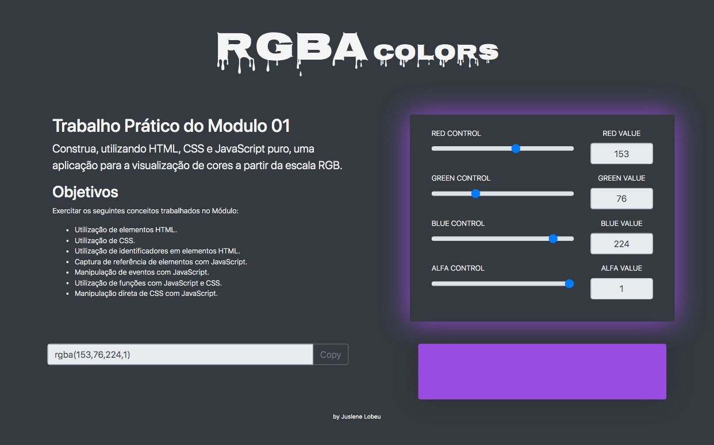

# Color range rgba()
Trabalho prático do Bootcamp "Desenvolvedor Full Stack" da IGTI

## Preview

### Link
[Github pages](https://juslenelobeu.github.io/colorRangeRGB/)

## Objetivo
Construa, utilizando HTML, CSS e JavaScript puro, uma aplicação para a visualização de cores a partir da escala RGB.

Exercitar os seguintes conceitos trabalhados no Módulo:

- [x] Utilização de elementos HTML.
- [x] Utilização de CSS.
- [x] Utilização de identificadores em elementos HTML.
- [x] Captura de referência de elementos com JavaScript.
- [x] Manipulação de eventos com JavaScript.
- [x] Utilização de funções com JavaScript e CSS.
- [x] Manipulação direta de CSS com JavaScript.
